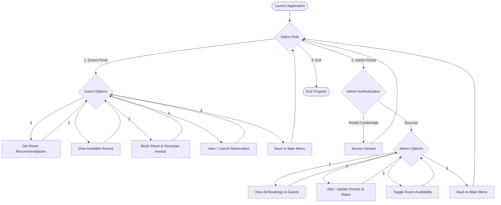

# Hotel Room Booking System 🏨
> **Day 05 Mini Project** — *IDRA Assignments*

A modular, interactive console application built in Python that simulates a full hotel operations workflow, featuring dual access portals for **Guests** and **Hotel Administrators**.

---

## 📌 Key Features

### 👤 Guest Portal
- **Intelligent Room Recommendation:** Matches guest requirements (budget range, number of occupants, preferred amenities) to suggest the most suitable rooms.
- **Real-Time Room Catalog:** Browse available room categories (Standard, Deluxe, Suite) with detailed pricing and availability status.
- **Automated Booking & Billing:** Instant reservation system that computes stay charges based on room rates and duration.
- **Booking Management & Cancellation:** Lookup active reservations by booking reference or room number, with instant room restoral upon cancellation.

### 🛠️ Admin Panel
- **Role-Based Authentication:** Secure passcode/login gate for hotel staff and administrators.
- **Live Inventory Dashboard:** Overview of total room inventory, current occupancy rates, and active guest records.
- **Room Management:** Add new rooms, update nightly pricing, and manually toggle room availability (e.g., for maintenance).
- **Audit & Revenue Records:** Inspect total bookings, active guest lists, and billing summaries.

---

## 🔄 System Workflow Diagram

---

## 💡 Concepts & Implementation Details

- **Recommendation Engine:** Evaluates user constraints (capacity and budget) against room metadata to return ranked suggestions.
- **State Management:** Dictionaries and lists used to maintain persistent in-memory records of rooms, bookings, and customer details.
- **Defensive Input Handling:** Validation loops for numeric inputs, invalid option selections, and date/night limits to prevent runtime errors.
- **Modular Code Structure:** Clean separation of concerns between guest-facing flows, administrative actions, and core helper functions.

---

## 🚀 How to Run

1. Open `Hotel_Room_Booking_System.ipynb` in **VS Code**, **Jupyter Notebook**, or **Google Colab**.
2. Run all cells sequentially (`Restart & Run All`) to launch the interactive console interface.
