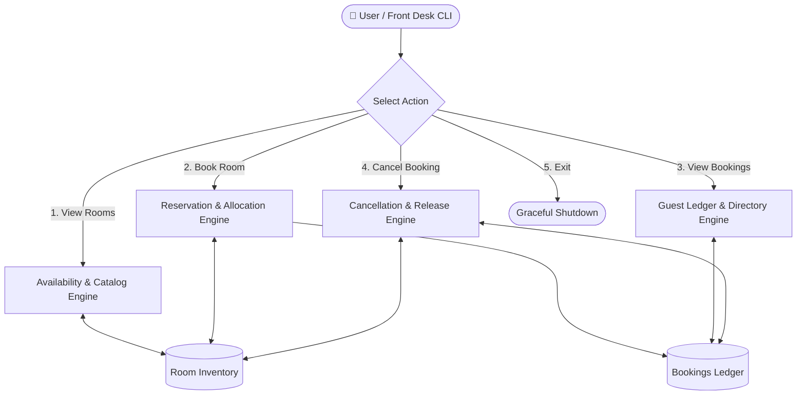
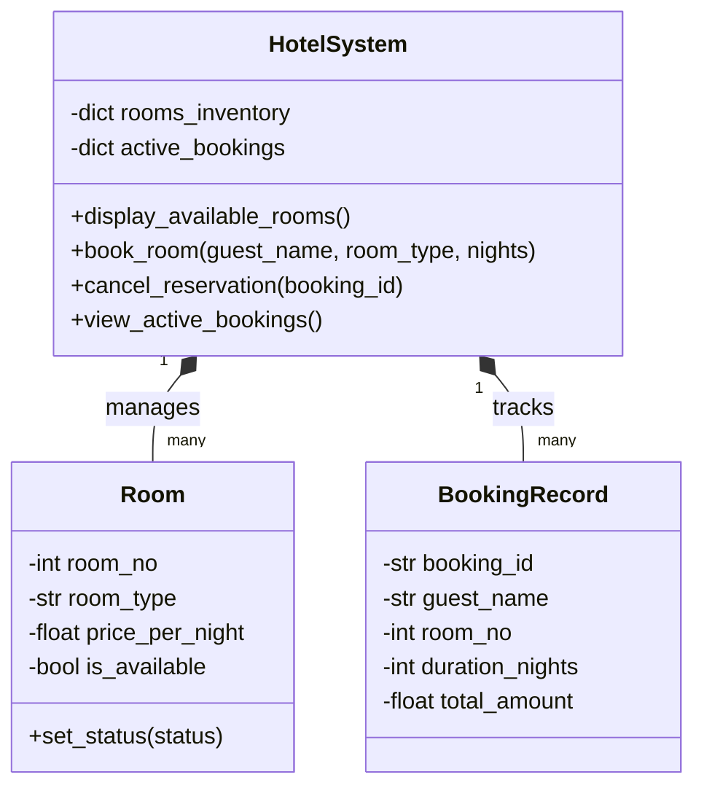
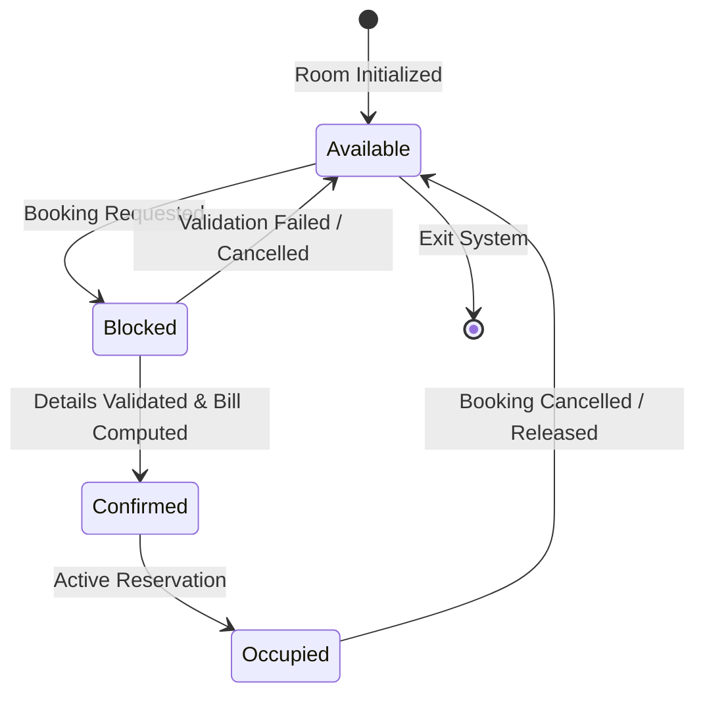

<div align="center">

# 🏨 Hotel Room Booking System
### *Day 05 Core Mini Project | Python OOP & State Management*


<p align="center">
  An end-to-end, menu-driven hotel reservation and inventory management application designed to handle real-time room availability, booking records, bill calculations, and cancellations.
</p>

</div>

---

## 📑 Table of Contents
- [Executive Overview](#-executive-overview)
- [System Architecture](#-system-architecture)
  - [High-Level Component Flow](#1-high-level-component-flow)
  - [Class & Domain Model](#2-class--domain-model)
  - [Transactional State Lifecycle](#3-transactional-state-lifecycle)
- [Core Feature Matrix](#-core-feature-matrix)
- [In-Memory Data Schemas](#-in-memory-data-schemas)
- [Setup & Execution Guide](#-setup--execution-guide)

---

## 📌 Executive Overview

The **Hotel Room Booking System** simulates real-world hotel front-desk operations. It manages room availability pools across multiple tiers (Standard, Deluxe, Suite), computes stay-duration pricing dynamically, records guest transactions, and guarantees state consistency with automatic inventory rollback during cancellations.

---

## 🏗️ System Architecture

### 1. High-Level Component Flow



---

### 2. Class & Domain Model



---

### 3. Transactional State Lifecycle



---

## ✨ Core Feature Matrix

| Feature | Implementation Logic | Operational Outcome |
| :--- | :--- | :--- |
| **Inventory Querying** | Categorical filtering on room map | Real-time status lookup by room category & rate |
| **Smart Allocation** | First-available room ID resolution | Eliminates room collisions and double-booking |
| **Dynamic Billing** | Nightly rate $\times$ duration calculator | Computes total costs instantly |
| **Atomic Cancellation** | Reversible transaction state | Frees room flag and purges booking ledger entry |
| **Input Validation** | Defensive loops & input guards | Prevents unexpected crashes on invalid inputs |

---

## 🗄️ In-Memory Data Schemas

### `Room` Schema
```json
{
  "room_number": 101,
  "room_type": "Deluxe",
  "price_per_night": 2500.0,
  "is_available": true
}
```

### `BookingRecord` Schema
```json
{
  "booking_id": "RES-101",
  "guest_name": "John Doe",
  "room_number": 101,
  "room_type": "Deluxe",
  "nights": 3,
  "total_bill": 7500.0,
  "status": "CONFIRMED"
}
```

---

## 🚀 Setup & Execution Guide

1. Open `Hotel_Room_Booking_System.ipynb` in **Jupyter Notebook**, **VS Code**, or **Google Colab**.
2. Run all cells in order (`Restart & Run All`) to start the interactive console interface.
